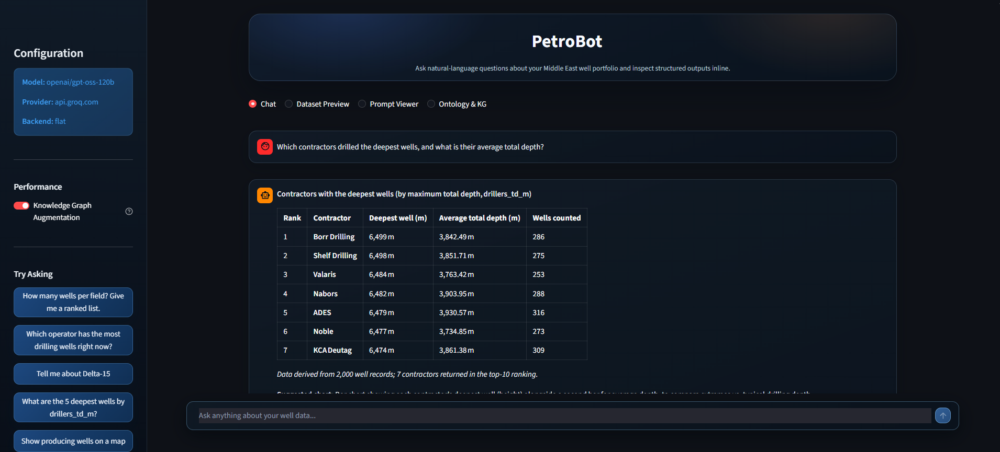
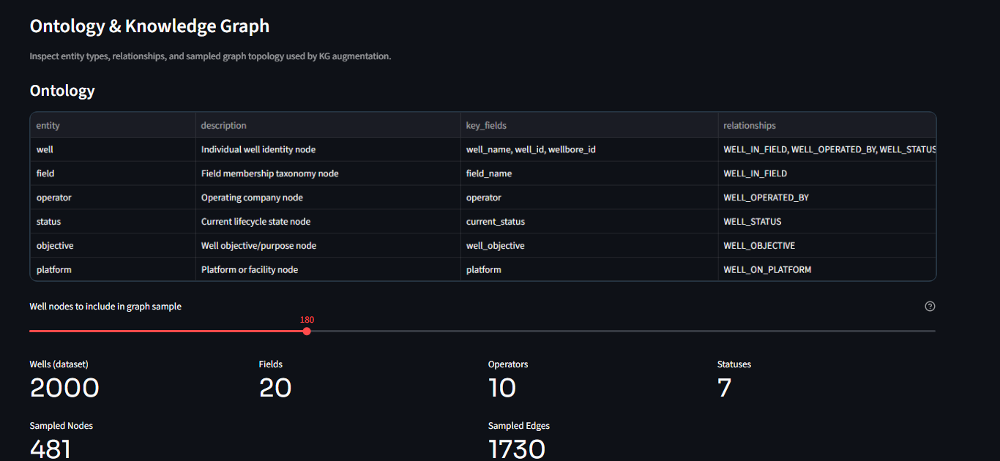
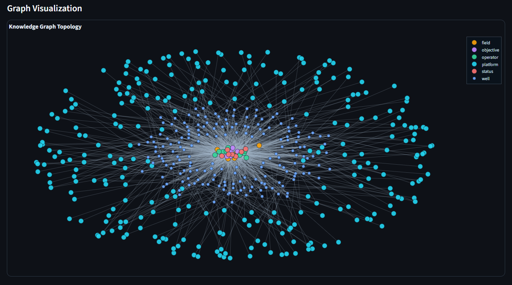

# PetroBot — LLM-Powered Well Analytics Engine

PetroBot is a natural language analytics engine for oil & gas well data. It lets engineers and analysts query a 2,000-well Middle East portfolio using plain English — no SQL, no dashboards, no custom reports. An LLM translates each question into a live MongoDB query, executes it, and returns a synthesised answer with supporting data.

---

## Interface

> Ask a question, get a structured answer. Every tool call and LLM response is fully auditable in the Prompt Viewer tab.

### Chat — Natural Language Analytics


<br/>

### Ontology & Knowledge Graph — Entity Explorer


<br/>

### Knowledge Graph Topology — Interactive Network


---

## What it does

- **Ask in plain English:** *"Which operator has the most drilling wells right now?"* → returns a ranked table in seconds.
- **Map visualisation:** *"Show all producing wells"* → renders an interactive geographic scatter map.
- **Well lookup with fuzzy matching:** *"Tell me about Deltta-15"* (typo) → still finds the right well.
- **Prompt transparency:** A built-in **Prompt Viewer** tab shows every tool call, query argument, and LLM reply so the reasoning is fully auditable.
- **Dataset preview:** Browse the raw CSV directly inside the UI.
- **Knowledge Graph:** An interactive graph explorer visualises well–field–operator–platform relationships and provides query hints to the LLM.

---

## Architecture

```
┌──────────────────────────────────────────┐
│            Streamlit UI (app/)           │
│  Chat  │  Dataset Preview  │  KG View    │
│         Prompt Viewer                    │
└────────────────┬─────────────────────────┘
                 │ run_agent()
┌────────────────▼─────────────────────────┐
│          Agent Loop (agent.py)           │
│  1. Build context: system prompt + KG    │
│  2. Call LLM with 4 tool schemas         │
│  3. Dispatch tool → execute on MongoDB   │
│  4. Feed result back → repeat            │
│  5. Return structured AgentResponse      │
└──────┬───────────────────┬───────────────┘
       │                   │
┌──────▼──────┐   ┌────────▼──────────────┐
│  KG Module  │   │   Tool Router         │
│ graph_       │   │  query_wells          │
│ context.py  │   │  aggregate_wells       │
│ (networkx)  │   │  get_well (fuzzy)      │
└─────────────┘   │  get_map_data          │
                  └────────┬──────────────┘
                           │
              ┌────────────▼──────────────┐
              │  Backend Layer            │
              │  flat_backend  (default)  │
              │  osdu_backend  (OSDU mode)│
              └────────────┬─────────────┘
                           │
              ┌────────────▼──────────────┐
              │  MongoDB Atlas            │
              │  wells_flat collection    │
              │  (auto-seeded from CSV)   │
              └───────────────────────────┘
```

### Key design decisions

| Decision | Rationale |
|---|---|
| **LLM writes the queries** | The LLM constructs every MongoDB filter and aggregation pipeline at runtime. No hand-written queries — the LLM's full expressiveness is used. |
| **Read-only safety scanner** | A recursive `check_safe()` function blocks all write/destructive MongoDB operators (`$out`, `$merge`, `$set`, etc.) before any query runs. |
| **Dual backend (flat / OSDU)** | Swap `DATA_BACKEND=flat` (simple CSV schema) or `DATA_BACKEND=osdu` (full OSDU nested envelope) via `.env`. Same 4 tools, same agent loop, different collection. |
| **Provider-agnostic LLM** | Uses the standard OpenAI SDK with a configurable `base_url`. Works with OpenAI, OpenRouter, Ollama, Azure, or any compatible endpoint — no vendor lock-in. |
| **KG augmentation** | A `networkx` graph is built from the CSV at startup (cached with `lru_cache`). For each user query, matched entities and their relationships are injected as system-message hints before the LLM replies. |
| **Auto-seeding** | On first run the flat backend detects an empty MongoDB collection and seeds it from the CSV automatically. Zero manual setup. |

---

## Tech Stack

| Layer | Technology |
|---|---|
| **Frontend** | Streamlit |
| **LLM Integration** | OpenAI SDK (provider-agnostic) + OpenRouter |
| **Database** | MongoDB Atlas (M0 Free Tier) |
| **Knowledge Graph** | NetworkX |
| **Fuzzy Matching** | TheFuzz (Levenshtein) |
| **Data Processing** | Pandas |
| **Visualisation** | Plotly (maps + KG graph) |
| **Language** | Python 3.11+ |

---

## Project Structure

```
petrobot/
├── app/
│   ├── main.py               # Streamlit entry point + tab layout
│   ├── chat.py               # Chat interface logic
│   ├── assets/style.css      # Custom dark glassmorphic theme
│   └── components/
│       ├── sidebar.py        # Demo queries + config panel
│       ├── map_view.py       # Plotly scatter map
│       ├── kg_view.py        # KG graph explorer
│       └── prompt_viewer.py  # Full LLM trace inspector
├── backend/
│   └── agent/
│       ├── agent.py          # Agent loop + AgentResponse dataclass
│       ├── backends/
│       │   ├── flat_backend.py   # Flat CSV-style query execution
│       │   ├── osdu_backend.py   # Full OSDU schema query execution
│       │   └── router.py         # Tool dispatcher
│       ├── kg/
│       │   └── graph_context.py  # KG build + context generation
│       ├── prompts/
│       │   ├── flat_prompt.py    # System prompt for flat backend
│       │   └── osdu_prompt.py    # System prompt for OSDU backend
│       └── schemas/              # OpenAI tool schemas
├── config/settings.py        # Centralised env config loader
├── Data/
│   └── well-information.csv  # 2,000 well records (source of truth)
├── .env.example              # Environment variable template
├── requirements.txt
└── run.py                    # Start the Streamlit app
```

---

## Quick Start

```bash
# 1. Clone and set up environment
git clone <repo-url> && cd petrobot
python -m venv venv && venv\Scripts\activate  # Windows
pip install -r requirements.txt

# 2. Configure
cp .env.example .env
# Fill in: LLM_API_KEY, LLM_MODEL, MONGO_URI

# 3. Run
python run.py
```

The app seeds MongoDB automatically on first launch — no separate data ingestion step needed.

---

## Environment Variables

| Variable | Required | Description |
|---|---|---|
| `LLM_API_KEY` | ✅ | API key for your LLM provider |
| `LLM_BASE_URL` | ✅ | OpenAI-compatible API base URL |
| `LLM_MODEL` | ✅ | Model identifier (e.g. `deepseek/deepseek-r1:free`) |
| `MONGO_URI` | ✅ | MongoDB Atlas connection string |
| `DATA_BACKEND` | ❌ | `flat` (default) or `osdu` |
| `MAX_TOOL_ROUNDS` | ❌ | Max LLM tool calls per turn (default: 6) |
