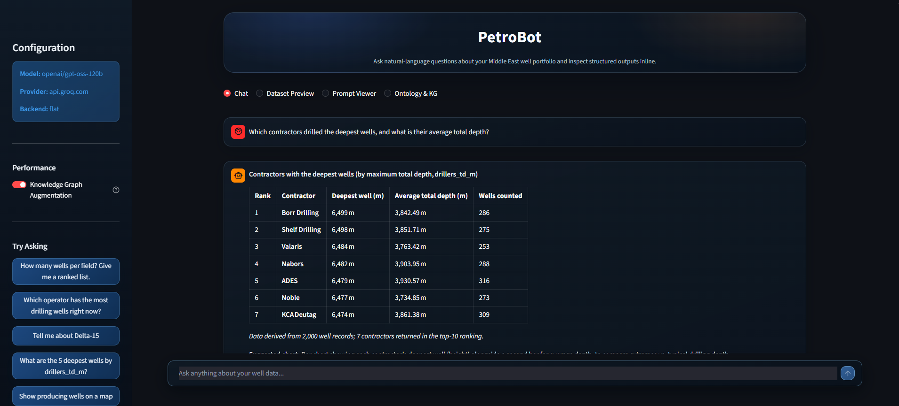
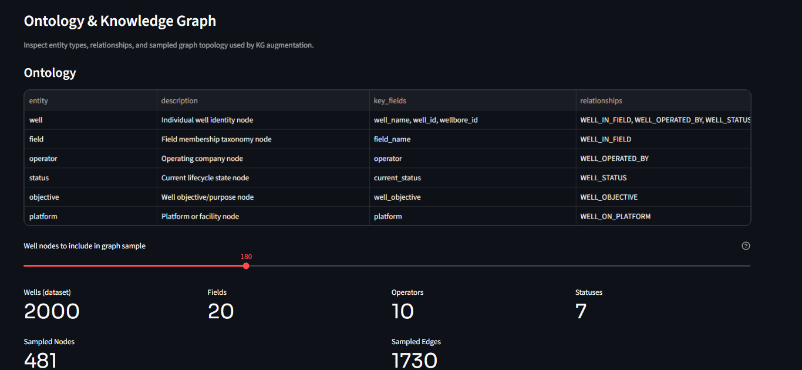
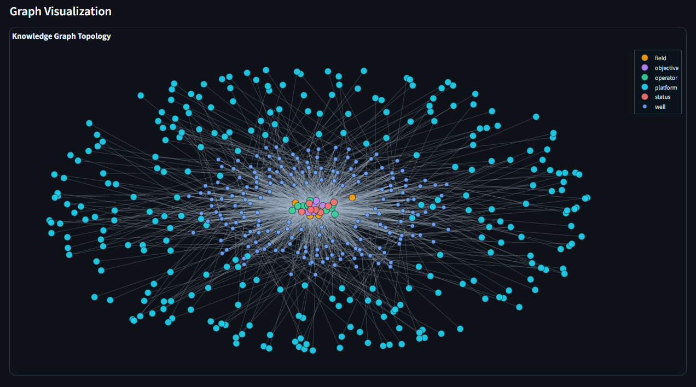

# PetroBot - LLM-Powered Well Information & Production Analytics Engine

PetroBot is a natural language analytics engine for oil & gas operations. It enables engineers and analysts to query well information and production data using plain English, with no SQL, no dashboards, and no pre-built reports required. An LLM agent translates each question into a live database query, executes it safely, and returns a synthesized answer with supporting data tables and maps.

---

## Interface

> Ask a question, get a structured answer. Every tool call and LLM response is fully auditable in the Prompt Viewer tab.

### Chat - Natural Language Analytics


<br/>

### Ontology & Knowledge Graph - Entity Explorer


<br/>

### Knowledge Graph Topology - Interactive Network


---

## What it does

- **Ask in plain English:** *"Which operator has the most drilling wells right now?"* -> returns a ranked table in seconds.
- **Map visualization:** *"Show all producing wells"* -> renders an interactive geographic scatter map.
- **Well lookup with fuzzy matching:** *"Tell me about Deltta-15"* (typo) -> still finds the right well.
- **Prompt transparency:** A built-in **Prompt Viewer** tab shows every tool call, query argument, and LLM reply so the reasoning is fully auditable.
- **Dataset preview:** Browse the raw CSV directly inside the UI.
- **Knowledge Graph:** An interactive graph explorer visualizes well-field-operator-platform relationships and provides query hints to the LLM.

---

## Architecture

```text
Streamlit UI (app/)
  |-- Chat
  |-- Dataset Preview
  |-- Prompt Viewer
  `-- Ontology & KG

          |
          v

Agent Feature (backend/features/agent/)
  1. Build context: system prompt + KG grounding
  2. Call selected LLM provider with tool schemas
  3. Dispatch tool call
  4. Execute read-only MongoDB query
  5. Feed result back to the model
  6. Return structured AgentResponse

          |
          +--> Knowledge Graph Feature
          |      - graph_context.py
          |      - grounding.py
          |
          +--> Tool Backends
                 - query_wells
                 - aggregate_wells
                 - get_well
                 - get_map_data

          |
          v

MongoDB Atlas
  - wells_flat collection
  - auto-seeded from CSV
```

### Key design decisions

| Decision | Rationale |
|---|---|
| **LLM writes the queries** | The LLM constructs every MongoDB filter and aggregation pipeline at runtime. No hand-written queries; the LLM's full expressiveness is used. |
| **Read-only safety scanner** | A recursive `check_safe()` function blocks all write/destructive MongoDB operators (`$out`, `$merge`, `$set`, etc.) before any query runs. |
| **Dual backend (flat / OSDU)** | Swap `DATA_BACKEND=flat` (simple CSV schema) or `DATA_BACKEND=osdu` (full OSDU nested envelope) via `.env`. Same 4 tools, same agent loop, different collection. |
| **Provider-agnostic LLM** | Uses curl-based provider adapters with configurable provider, model, base URL, and API key. Works with Google AI Studio, Groq, OpenRouter, and OpenAI-compatible APIs. |
| **KG grounding** | A NetworkX graph plus deterministic grounding layer resolves entity mentions, constrains planning, and validates tool calls before execution. |
| **Auto-seeding** | On first run the flat backend detects an empty MongoDB collection and seeds it from the CSV automatically. Zero manual setup. |

---

## Tech Stack

| Layer | Technology |
|---|---|
| **Frontend** | Streamlit |
| **LLM Integration** | Curl-based provider adapters |
| **Database** | MongoDB Atlas (M0 Free Tier) |
| **Knowledge Graph** | NetworkX |
| **Fuzzy Matching** | TheFuzz (Levenshtein) |
| **Data Processing** | Pandas |
| **Visualization** | Plotly (maps + KG graph) |
| **Language** | Python 3.11+ |

---

## Project Structure

```text
petrobot/
|-- app/
|   |-- main.py                  # Streamlit entry point and feature routing
|   |-- assets/style.css         # App styling
|   |-- features/
|   |   |-- chat/view.py          # Chat workflow
|   |   |-- dataset_preview/view.py
|   |   |-- knowledge_graph/view.py
|   |   `-- prompt_viewer/view.py
|   `-- shared/components/
|       |-- sidebar.py            # Runtime config and demo prompts
|       |-- map_view.py           # Reusable map rendering
|       `-- charts.py
|-- backend/
|   |-- ARCHITECTURE.md
|   |-- features/
|   |   |-- agent/                # Agent loop, prompts, schemas, tool backends
|   |   `-- knowledge_graph/      # KG graph, grounding, planner constraints
|   `-- shared/
|       |-- data_access/          # MongoDB clients, seed scripts, URI helpers
|       |-- llm/                  # Curl transport and provider adapters
|       `-- validators/           # Read-only safety and JSON helpers
|-- config/settings.py            # Centralized env config loader
|-- Data/                         # Source datasets
|-- docs/screenshots/             # README screenshots
|-- tests/
|   |-- agent/test_agent.py
|   `-- knowledge_graph/kg_eval/  # Offline KG evaluation suite
|-- requirements.txt
`-- run.py                        # Start the Streamlit app
```

---

## Quick Start

```bash
# 1. Clone and set up environment
git clone <repo-url> && cd petrobot
python -m venv venv && venv\Scripts\activate  # Windows
pip install -r requirements.txt

# 2. Configure
cp .env.example .env
# Fill in: LLM_API_KEY, LLM_MODEL, MONGO_URI

# 3. Run
python run.py
```

The app seeds MongoDB automatically on first launch; no separate data ingestion step is needed.

---

## Environment Variables

| Variable | Required | Description |
|---|---|---|
| `LLM_PROVIDER` | No | `google_ai_studio`, `groq`, `openrouter`, or `openai_compatible` |
| `LLM_API_KEY` | Yes | API key for the selected LLM provider |
| `LLM_BASE_URL` | Yes | Provider API base URL |
| `LLM_MODEL` | Yes | Model identifier |
| `MONGO_URI` | Yes | MongoDB Atlas connection string |
| `DATA_BACKEND` | No | `flat` (default) or `osdu` |
| `MAX_TOOL_ROUNDS` | No | Max LLM tool calls per turn (default: 6) |
| `LLM_TIMEOUT_S` | No | Provider request timeout in seconds (default: 30) |

---

## Knowledge Graph Grounding (How It Works)

In flat backend mode, KG is implemented as a deterministic 7-stage grounding pipeline:

1. **Schema Scope**
- Infer the domain and allowed table/columns/filters for the question.

2. **Candidate Generation**
- Generate entity candidates for mentions, especially well names with typos or format drift.

3. **Entity Resolution**
- Pick canonical IDs/values with confidence, and flag ambiguity when close candidates exist.

4. **Path Constraints**
- Build relationship-safe query constraints so planner/tool calls stay schema-valid.

5. **Planner Control Packet**
- Inject a structured packet into the LLM prompt: `resolved_entities`, `unresolved_mentions`, `schema_scope`, and hard constraints.

6. **Execution-Guided Repair**
- If schema validation fails, attempt one deterministic repair, re-validate, then execute.

7. **Final Validation Gate**
- Validate filter fields and pipeline references against the flat schema before DB execution.

This ensures canonical entity usage, constrained planning, and strict query validation.

Core KG files:

- `backend/features/knowledge_graph/graph_context.py`
- `backend/features/knowledge_graph/grounding.py`
- `backend/features/agent/service.py`
- `backend/features/agent/backends/router.py`
